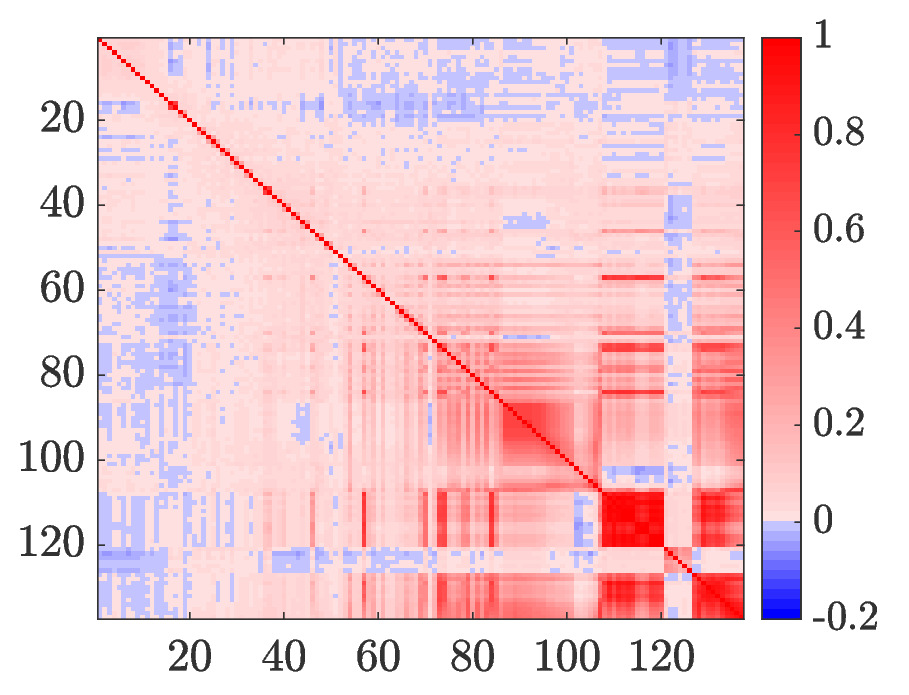
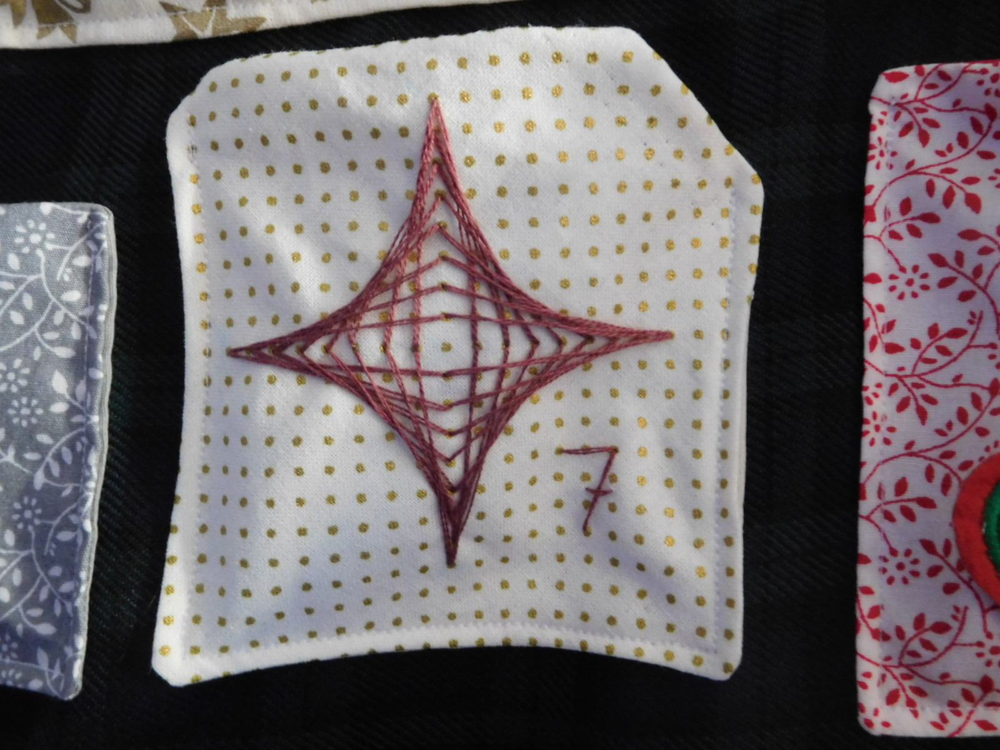

layout: page
title: "Scientific Crafting"
permalink: /scicraft/

I'm a keen crafter and have been experimenting with incorporating my research into craft projects. Here are some recent Sci Craft projects!

### IASI correlation matrix

Based on the untreated correlation matrix for IASI (a satellite-based Infrared instrument) that I used as a case study in my thesis:

I created a cross-stitch version! This took me just over a year on and off, and I'll admit the colour scheme is not based on best practices for data visualisation
but rather which colour flosses I had available!

### Data assimilation schematic

I made these as thank you gifts for my PhD supervisors when I passed my viva. The schematic is based on a figure from ECMWF that is often used to 
motivate 4D-Variational Data Assimilation in talks

