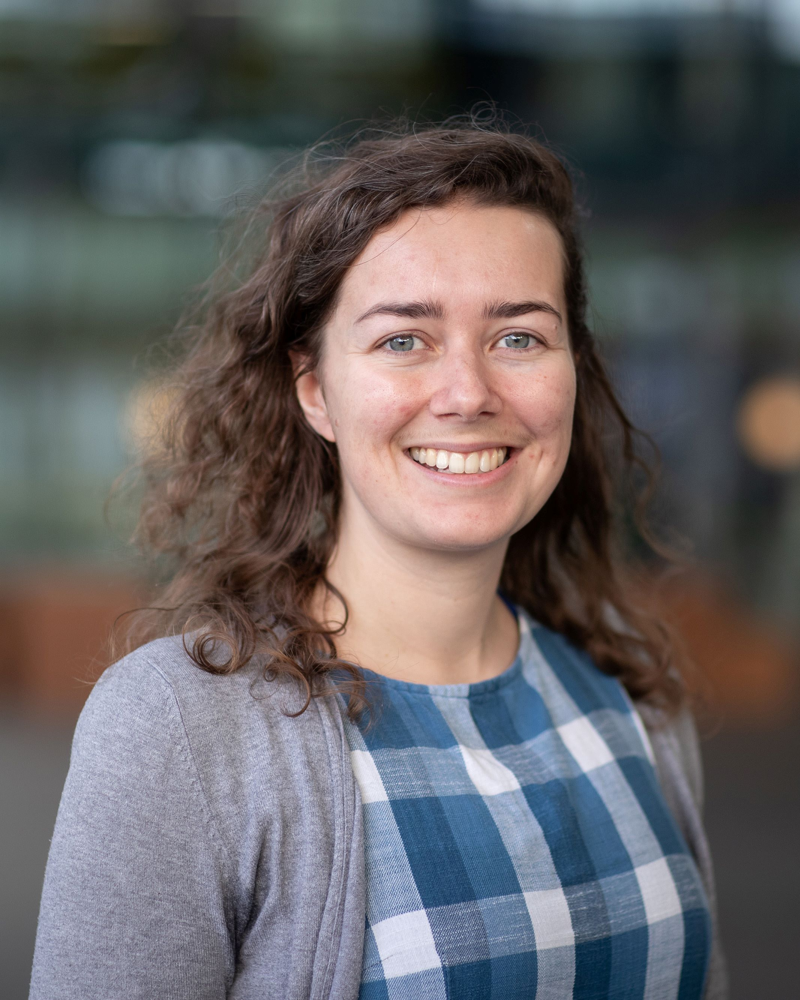
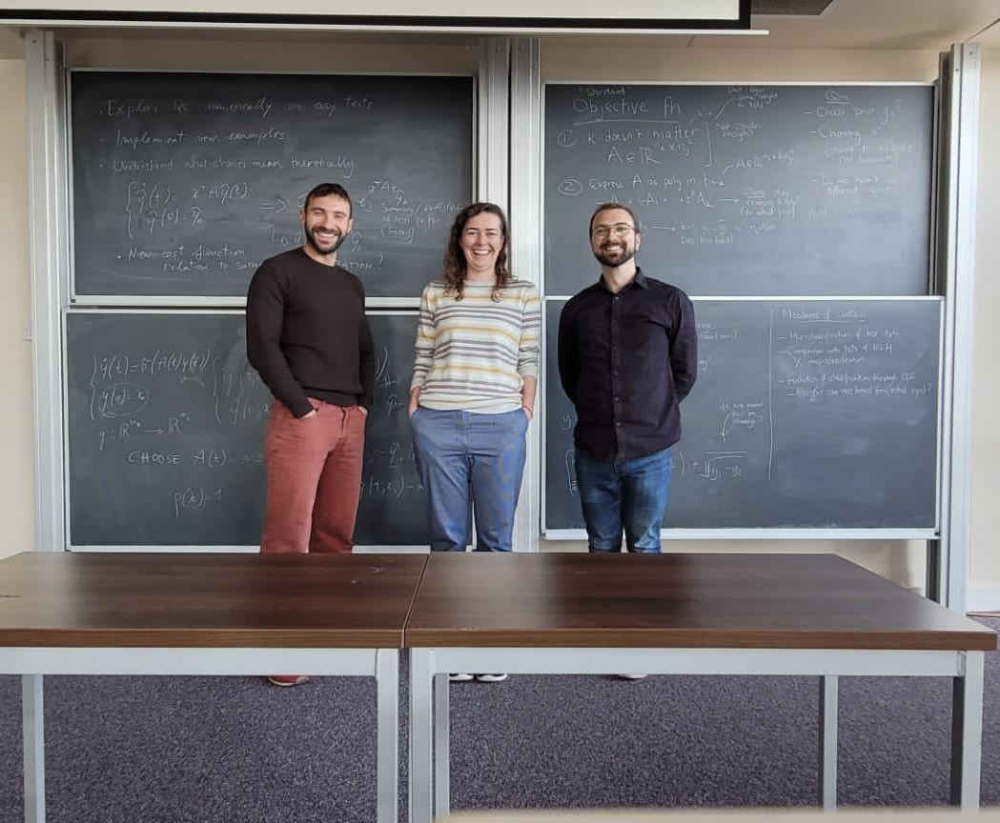
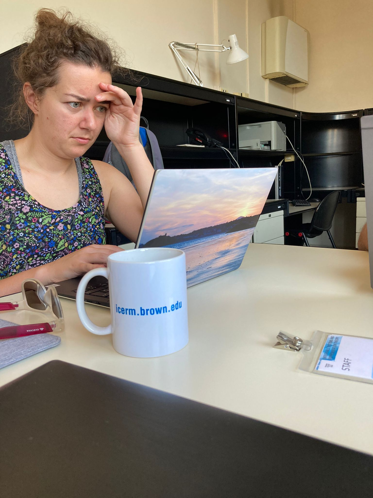

# About me

I am an Assistant Professor in the Computational Science group within the Centre for Analysis, Scientific Computing and Applications at TU Eindhoven. My research interests include large scale numerical linear algebra (theory and applications), data assimilation, and treatment of covariance matrices. Alongside my research I'm interested in outreach and scientific crafting. Contact me at j[.]m[.]tabeart[at]tue[.]nl and find out more about the [Computational Science group here](https://casa.win.tue.nl/home/computational-science/). I don't currently have funding for PhD students, but I have openings to supervise Bachelor and Master Final Projects -- some of the topics I am offering can be found [here](https://casa.win.tue.nl/home/m/education/project-and-internships/).

   
    

# News
Registration for Dutch Mastermath courses is now open. I'll be teaching a course on Advanced Numerical Linear Algebra with Applications (to Machine Learning and Data Assimilation) with Victorita Dolean-Maini. Find out more and enrol [here](https://elo.mastermath.nl/enrol/index.php?id=1249).

I'm giving a plenary at the Preconditioning meeting, to be held at ICMS Edinburgh in May 2026. Find out more and submit a minisymposium [here](https://icms.ac.uk/activities/workshop/precond26/)

I'm co-Chair of Section 17 on Applied and Linear Algebra at GAMM. Abstract submission has been extended to 8th January 2026, so please consider [submitting](https://jahrestagung.gamm.org/annual-meeting-2024/registration-abstract-submission/) a talk.

I've been awarded a [CoSeC fellowship](https://www.cosec.ac.uk/what-is-cosec/cosec-fellowship-programme/). I'll be using the funds to organise a hackathon at Rutherford Appleton Laboratory in the UK to extend the functionality and test cases for variational data assimilation in [Firedrake](firedrakeproject.org). More details to follow! 

Interested in better understanding the role of numerical linear algebra in data assimilation? Together with collaborators from the PVDAP network we have just posted an introductory paper aimed at those new to data assimilation [on arXiv](https://arxiv.org/abs/2506.09211).

New preprint with collaborators in Edinburgh and CERFACS looking at approximating block alpha-circulant preconditioners for all-at-once diffusion-based covariance operators [on arXiV](https://arxiv.org/abs/2506.03947). For some non-technical insight into this project, I wrote a blog post for the [DARC blog](https://research.reading.ac.uk/met-darc/2025/06/18/how-computational-limitations-can-lead-to-fun-and-new-mathematics/) about how computational constraints can lead us to really interesting mathematical challenges.

I have joined the 4TU.AMI SRI in Bridging Numerical Analysis and Machine Learning. More about the Strategic Research Initiative can be found [here](https://www.4tu.nl/ami/Research/sri-bridgingNAML/)

# Work and education history

[Find my CV here](./assets/CV.pdf)
October 2023 - Present: Assistant Professor at TU Eindhoven. University teaching qualification awarded September 2025.

October 2022 - October 2023: Fulford Non-Stipediary Fellow at Somerville College

September 2022 - October 2023: Hooke Fellow in the Mathematical Institute at the University of Oxford in the Numerical Analysis group.

2019 - August 2022: PDRA in the School of Mathematics at The University of Edinburgh working with Dr John W. Pearson

Spring 2020: Semester Postdoctoral Fellow at the Institute for Computational and Experimental Research in Mathematics at Brown University

2016 - 2019: PhD at the University of Reading with Professor Sarah Dance, Dr Amos Lawless, Professor Nancy Nichols and Dr Joanne Waller. [Read my thesis here](http://centaur.reading.ac.uk/88830/) 

2015 - 2016: MRes at Imperial College, London and University of Reading as part of the Mathematics of Planet Earth Centre for Doctoral Training

2011 - 2015: MMath at the University of Bath with Study Year Abroad at Université Joseph Fourier (now Université Grenoble Alpes)

# Some recent papers

[My google scholar profile](https://scholar.google.com/citations?user=3CJhooAAAAAJ&hl=en)

### [An Introduction to Solving the Least-Squares Problem in Variational Data Assimilation](https://arxiv.org/abs/2506.09211)
Ieva Daužickaitė, Melina A. Freitag, Selime Gürol, Amos S. Lawless, Alison Ramage, Jennifer A. Scott, Jemima M. Tabeart

### [Block Alpha-Circulant Preconditioners for All-at-Once Diffusion-Based Covariance Operators](https://arxiv.org/abs/2506.03947)
Jemima M. Tabeart, Selime Gürol, John W. Pearson, Anthony T. Weaver

### [Saddle point preconditioners for weak-constraint 4D-Var](http://doi.org/10.1553/etna_vol60s197)
Jemima M. Tabeart and John W. Pearson

### [Stein-based preconditioners for weak-constraint 4D-var](https://doi.org/10.1016/j.jcp.2023.112068)  
Davide Palitta and Jemima M. Tabeart

### [Model Reduction of Linear Dynamical Systems via Balancing for Bayesian Inference](https://link.springer.com/article/10.1007/s10915-022-01798-8)
Elizabeth Qian, Jemima M. Tabeart, Christopher Beattie, Serkan Gugercin, Jiahua Jiang, Peter R. Kramer and Akil Narayan 

### [Saddle point preconditioners for weak-constraint 4D-Var](https://arxiv.org/abs/2105.06975)
Jemima M Tabeart and John W Pearson

### [The conditioning of least squares problems in preconditioned variational data assimilation](https://arxiv.org/abs/2010.08416)
Jemima M Tabeart, Sarah L Dance, Amos S Lawless, Nancy K Nichols, Joanne A Waller

### [The impact of using reconditioned correlated observation‐error covariance matrices in the Met Office 1D‐Var system](https://doi.org/10.1002/qj.3741)
Jemima M Tabeart, Sarah L Dance, Amos S Lawless, Stefano Migliorini, Nancy K Nichols, Fiona Smith, Joanne A Waller

### [Improving the condition number of estimated covariance matrices](https://doi.org/10.1080/16000870.2019.1696646)
Jemima M Tabeart, Sarah L Dance, Amos S Lawless, Nancy K Nichols, Joanne A Waller

### [The conditioning of least‐squares problems in variational data assimilation](https://doi.org/10.1002/nla.2165)
Jemima M Tabeart, Sarah L Dance, Stephen A Haben, Amos S Lawless, Nancy K Nichols, Joanne A Waller

# Supervision

Hisham Elzayyadi (October 2024 -- present) PhD student 

# Teaching
2025--26

2WBB0 -- Calculus for computer scientists (lecturer)

2DD40 -- Math 1 (instructor)

2DME20/2MMD10 -- Nonlinear Optimization (instructor)

JBM180 -- Linear algebra for data analysis (responsible lecturer)

MasterMath -- Advanced numerical linear algebra with applications (co-lecturer)

2024--25

2DD40 -- Math 1 (instructor)

2DRR00 -- Linear algebra and Applications (responsible lecturer and instructor)

2DBA0 -- Matrices and differential equations (instructor)

# Other activities
I'm trying to fly less for work and personal travel, and I'm always happy to share ideas and route planning advice. I blog about my exploits via active travel and public transport at [Adventures of a Mathematician](https://lerabotproblems.wordpress.com). Some recent non-flight journeys include:
Eindhoven - Toulouse - Edinburgh - Eindhoven
Eindhoven to: Copenhagen, Vienna, Chemnitz, Geneva, Glasgow, Oxford
