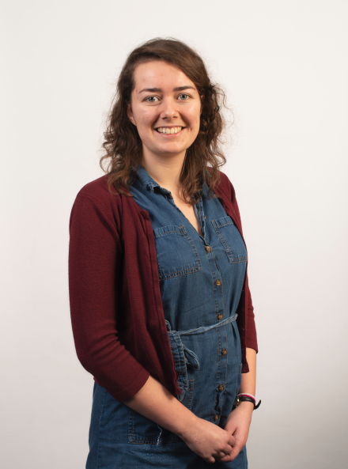
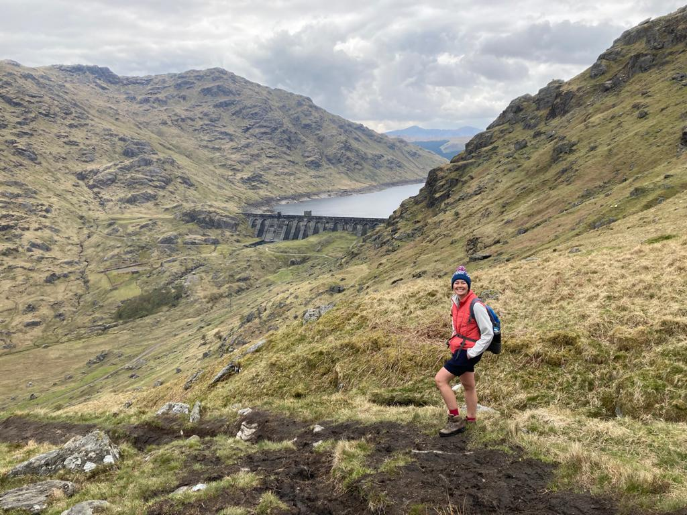

# About me

I am a Hooke Fellow in the Mathematical Institute at the University of Oxford. My research interests include large scale numerical linear algebra (theory and applications), data assimilation, and treatment of covariance matrices. Alongside my research I'm interested in outreach and scientific crafting.

 

# News

I've just started a Hooke Fellowship in Oxford!

Successful grant funding from UNA Europa - Seed Funding DIGITALIZED! for the research project "Tensor-based Optimal Control approaches for Deep learning - TOC4Deep"  [Find out more here](https://site.unibo.it/toc4deep/en). See the website for information on events, and videos from past workshop talks.

I co-organised a workshop in April 2022 in Edinburgh on Recent Advances in Numerical Linear Algebra: Talks are on the website if you weren't able to join us in person https://www.icms.org.uk/workshops/2022/recent-advances-numerical-linear-algebra-pdes-optimization-and-data-assimilation

# Work and education history

[Find my CV here](./assets/CV_JTabeart21.pdf)

October 2022 - Present: Fulford Non-Stipediary Fellow at Somerville College

September 2022 - Present: Hooke Fellow in the Mathematical Institute at the University of Oxford in the Numerical Analysis group.

2019 - August 2022: PDRA in the School of Mathematics at The University of Edinburgh working with Dr John W. Pearson

Spring 2020: Semester Postdoctoral Fellow at the Institute for Computational and Experimental Research in Mathematics at Brown University

2016 - 2019: PhD at the University of Reading with Professor Sarah Dance, Dr Amos Lawless, Professor Nancy Nichols and Dr Joanne Waller. [Read my thesis here](http://centaur.reading.ac.uk/88830/) 

2015 - 2016: MRes at Imperial College, London and University of Reading as part of the Mathematics of Planet Earth Centre for Doctoral Training

2011 - 2015: MMath at the University of Bath with Study Year Abroad at Université Joseph Fourier (now Université Grenoble Alpes)

# Some recent papers

[My google scholar profile](https://scholar.google.com/citations?user=3CJhooAAAAAJ&hl=en)

### [Stein-based preconditioners for weak-constraint 4D-var](https://arxiv.org/abs/2203.17184) 
Davide Palitta and Jemima M. Tabeart

### [Model Reduction of Linear Dynamical Systems via Balancing for Bayesian Inference](https://link.springer.com/article/10.1007/s10915-022-01798-8)
Elizabeth Qian, Jemima M. Tabeart, Christopher Beattie, Serkan Gugercin, Jiahua Jiang, Peter R. Kramer and Akil Narayan 

### [Saddle point preconditioners for weak-constraint 4D-Var](https://arxiv.org/abs/2105.06975)
Jemima M Tabeart and John W Pearson

### [The conditioning of least squares problems in preconditioned variational data assimilation](https://arxiv.org/abs/2010.08416)
Jemima M Tabeart, Sarah L Dance, Amos S Lawless, Nancy K Nichols, Joanne A Waller

### [The impact of using reconditioned correlated observation‐error covariance matrices in the Met Office 1D‐Var system](https://doi.org/10.1002/qj.3741)
Jemima M Tabeart, Sarah L Dance, Amos S Lawless, Stefano Migliorini, Nancy K Nichols, Fiona Smith, Joanne A Waller

### [Improving the condition number of estimated covariance matrices](https://doi.org/10.1080/16000870.2019.1696646)
Jemima M Tabeart, Sarah L Dance, Amos S Lawless, Nancy K Nichols, Joanne A Waller

### [The conditioning of least‐squares problems in variational data assimilation](https://doi.org/10.1002/nla.2165)
Jemima M Tabeart, Sarah L Dance, Stephen A Haben, Amos S Lawless, Nancy K Nichols, Joanne A Waller

# Other activities

I'm a co-organiser of the Communications in Numerical Linear Algebra series: find out more at our [website](https://sites.google.com/view/commnla/home) or catch up on previous talks on our [Youtube channel](https://www.youtube.com/channel/UCSlAhBOIY68IWLxpPUFHuSQ)

Watch me [present](https://youtu.be/TsnHNBHYgdo?t=1620) a recent [pre-print](https://arxiv.org/abs/2105.06975)

Follow me on Twitter [@jemimatabeart](https://twitter.com/jemimatabeart) for updates and photos of my crafting efforts

Since moving to Scotland I've started Munro bagging - my latest stats are [here!](https://bit.ly/3xt6490)

 
